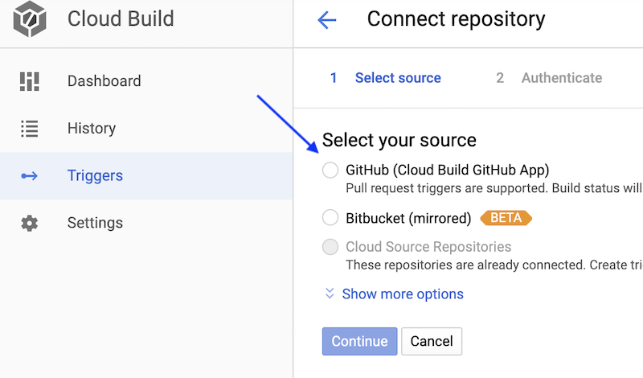
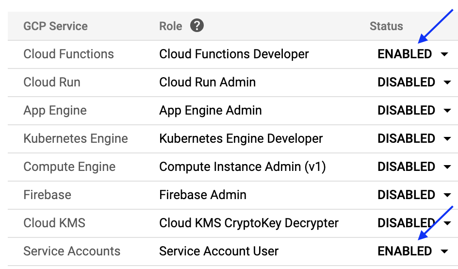
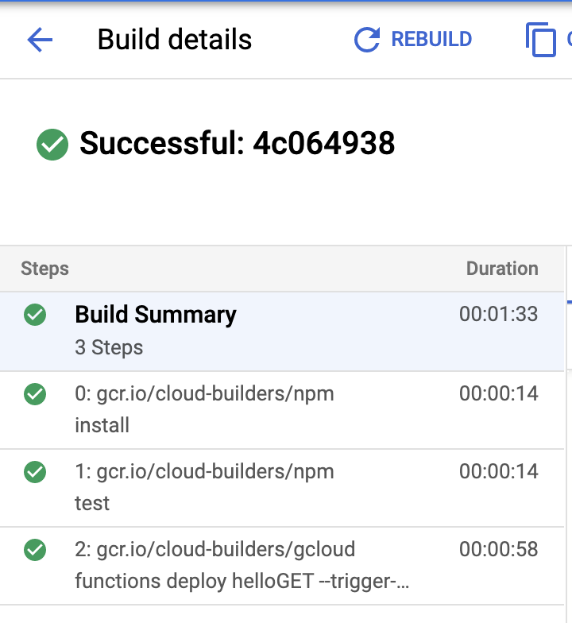

# Automate Deployments for Google Cloud Functions

Setup automated builds and deployments for Cloud Functions using Cloud Build

## Requirements

- Node.js
- Google Cloud Account
- Google Cloud SDK Command Line Tools

## Set up Local Development Environment

- Install [Node.js ^12.0.0](https://nodejs.org/en/)
- Create a [Google Cloud Account](https://cloud.google.com/)
- Create a [new project](https://console.cloud.google.com/projectcreate)
- Install the [Google Cloud SDK Command Line Tools](https://cloud.google.com/sdk/docs/quickstarts)
- Run `gcloud init` in your terminal to connect your Google Cloud Account

## Connect your repository to Cloud Build

- Fork this repository
- Clone your forked version of this repository
- Navigate to [Google Cloud Build/Triggers](https://console.cloud.google.com/cloud-build/triggers) to connect your GitHub repository
- Select the GitHub "Cloud Build GitHub App" option



- Provide access to your source repository
- Create a push trigger

## Enable Google Cloud API's

In [Cloud Build settings](https://console.cloud.google.com/cloud-build/settings/), enable Cloud Functions and Service Accounts



In [API's & Services](https://console.cloud.google.com/apis/dashboard), enable the following API's for your project:

- Cloud Functions API (For deploying cloud functions)
- Cloud Build API (For automated builds)
- Cloud Logging API (For build logs)
- Cloud Pub/Sub API (For Pub/Sub test)
- Cloud Resource Manager API (Step 2 will fail without this enabled)

## Prepare for running tests

Create a [storage bucket](https://console.cloud.google.com/storage/browser)

Create a [Pub/Sub topic](https://console.cloud.google.com/cloudpubsub/topic/list)

Set the following environment variables:

```bash
export $FUNCTIONS_TOPIC=<YOUR_TOPIC_NAME>
export $FUNCTIONS_DELETABLE_BUCKET=<YOUR_BUCKET_NAME>
```

Manually deploy the following cloud functions:

```bash
helloGET -> `gcloud functions deploy helloGET --runtime nodejs12 --trigger-http`

helloHTTP -> `gcloud functions deploy helloHttp --runtime nodejs12 --trigger-http`

helloPubSub -> `gcloud functions deploy helloPubSub --trigger-topic $FUNCTIONS_TOPIC --runtime nodejs12`

helloGCS -> `gcloud functions deploy helloGCS --runtime nodejs12 --trigger-resource $FUNCTIONS_DELETABLE_BUCKET --trigger-event providers/cloud.storage/eventTypes/object.change`
```

## Run the tests

From the `helloWorld` directory, install the project dependencies by running the following command:

```bash
npm install
```

Then, run the tests:

```bash
npm run test
```

## Run the build

Make a commit and push to the repository. This will trigger the build to begin. Google Cloud Build will read the `cloudbuild.yaml` file to build and deploy the cloud function. Navigate to your [Cloud Build Dashboard History](https://console.cloud.google.com/cloud-build/builds) to see your build in progress.

A successful build should look like this:



## References

- [Cloud Function Deploy Flags](https://cloud.google.com/sdk/gcloud/reference/functions/deploy)

**Note** - The functions and test used in this repository is from the GoogleCloudPlatform [nodejs-docs-samples](https://github.com/GoogleCloudPlatform/nodejs-docs-samples/tree/master/functions) examples.
